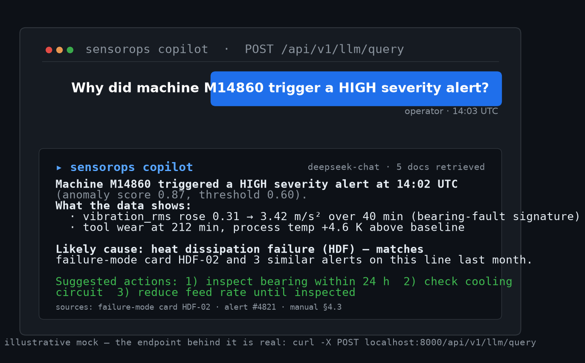
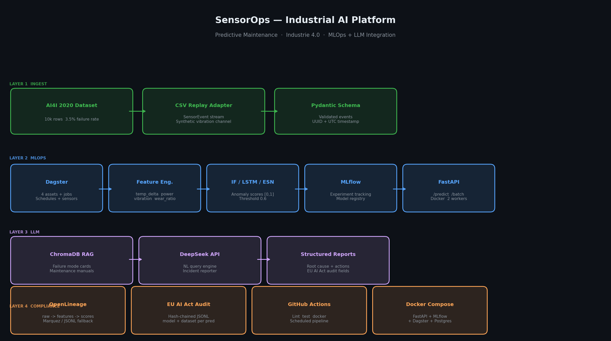
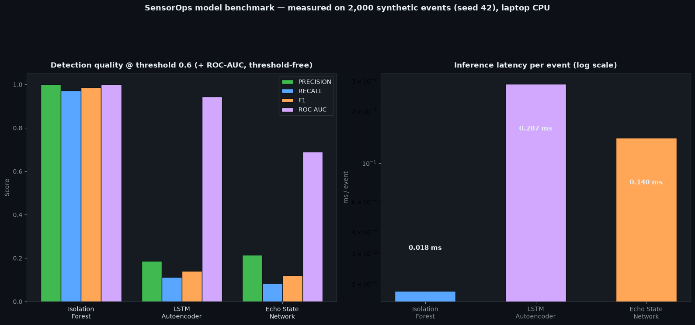
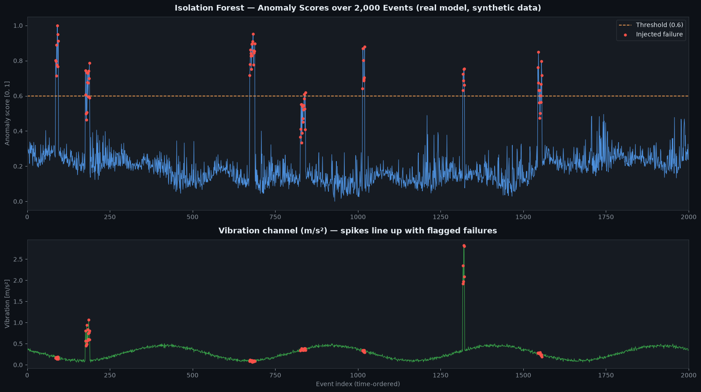
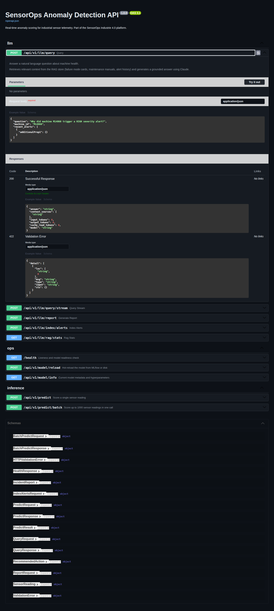
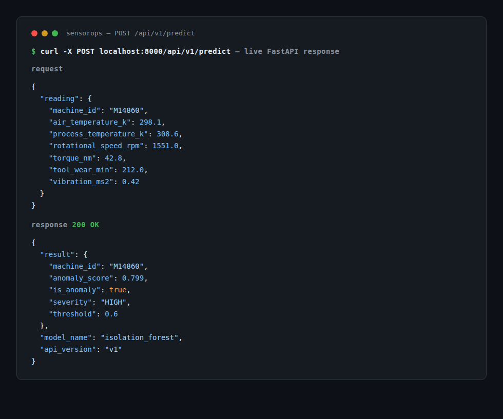
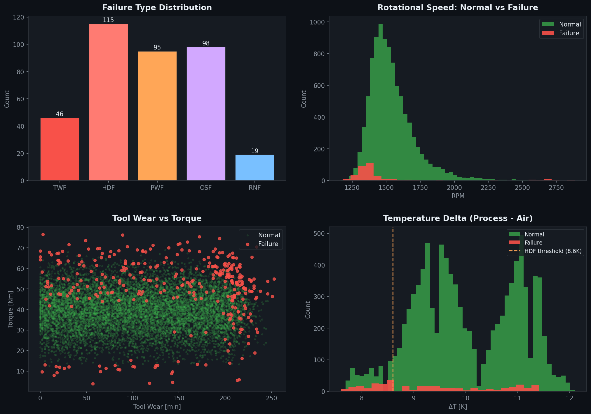
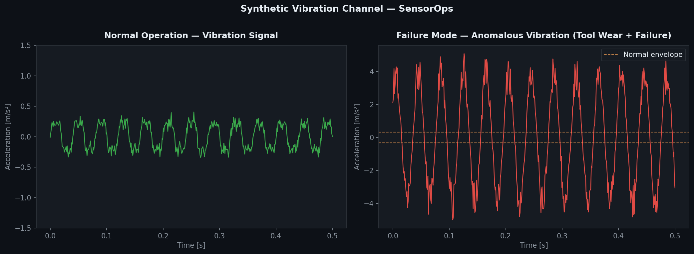
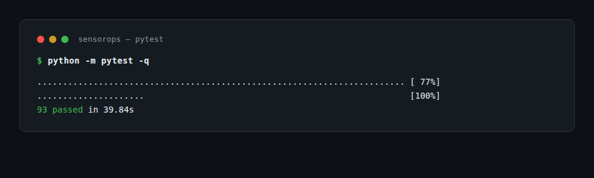

# SensorOps

An LLM copilot for industrial predictive maintenance: stream sensor telemetry, score anomalies in real time, and ask plain-language questions about what went wrong.

[](https://github.com/baddy1411/sensorops/actions/workflows/ci.yml)
[](https://python.org)
[](#testing)
[](#license)



I built SensorOps to learn how the pieces of a real ML system fit together — data ingestion, model training and serving, an LLM assistant on top, and an audit trail that would hold up in a regulated industry. It runs on the [AI4I 2020 predictive maintenance dataset](https://archive.ics.uci.edu/dataset/601) and is aimed at the kind of manufacturing environment you find all over Germany.

## Try the copilot first

Ask it something like *"Why did machine M14860 trigger a HIGH severity alert?"* — it retrieves from a ChromaDB RAG store (failure-mode reference cards, maintenance manuals, alert history) and answers with evidence, not vibes:

```bash
curl -X POST http://localhost:8000/api/v1/llm/query \
  -H "Content-Type: application/json" \
  -d '{"question": "Why did machine M14860 trigger a HIGH severity alert?", "machine_id": "M14860"}'
```

```json
{
  "answer": "Machine M14860 triggered a HIGH severity alert due to a Heat Dissipation Failure (HDF)...",
  "context_sources": ["built_in", "built_in", "alerts"],
  "input_tokens": 847,
  "output_tokens": 112
}
```

No API key? Everything except the LLM calls — ingestion, models, serving, all 93 tests — runs fully offline. The LLM features need a DeepSeek API key (`DEEPSEEK_API_KEY` in `.env`).

## What's inside

- **Three anomaly detectors** — Isolation Forest, LSTM autoencoder (PyTorch), and an Echo State Network from my M.Sc. thesis work — benchmarked against each other below.
- **LLM copilot** — DeepSeek + ChromaDB RAG answers operator questions and writes structured incident reports (root cause, evidence, recommended actions).
- **MLOps** — Dagster orchestration, MLflow tracking and registry, FastAPI serving in Docker, all wired up with `docker compose`.
- **EU AI Act-style compliance** — OpenLineage data lineage plus a hash-chained audit log recording every prediction (model version, dataset hash, score). Tamper-evident by construction.

## Architecture



Four layers, each independently deployable:

| Layer | Components | What it does |
|-------|-----------|--------------|
| **Ingest** | CSV replay adapter, Pydantic schema | Streams sensor events, adds a synthetic vibration channel |
| **MLOps core** | Dagster, MLflow, FastAPI, Docker | Orchestrates training, tracks experiments, serves models |
| **LLM** | DeepSeek API, ChromaDB RAG | Answers questions, writes structured incident reports |
| **Compliance** | OpenLineage, hash-chained audit log | Records data lineage and every prediction, tamper-evident |

## Benchmarks

Measured on 2,000 time-ordered synthetic events (~3.5% injected failures: bearing faults, overloads, thermal drift), seed 42, laptop CPU. All three are the repo's own model classes with default hyperparameters; features z-scored per column before fit. F1/precision/recall at the repo default threshold of 0.6; ROC-AUC is threshold-free.

| Model | Fit time | Latency / event | Throughput | Precision | Recall | F1 | ROC-AUC |
|-------|---------|-----------------|------------|-----------|--------|-----|---------|
| Isolation Forest | 0.40 s | 0.018 ms | ~55,300 ev/s | 1.000 | 0.972 | 0.986 | 1.000 |
| LSTM autoencoder | 53.0 s | 0.287 ms | ~3,481 ev/s | 0.186 | 0.113 | 0.140 | 0.944 |
| Echo State Network | 1.09 s | 0.140 ms | ~7,132 ev/s | 0.214 | 0.085 | 0.121 | 0.690 |



The honest read: Isolation Forest dominates this kind of tabular snapshot scoring — fast to train, fast to serve, and the contamination parameter maps cleanly onto the known failure rate. The LSTM autoencoder ranks anomalies well (ROC-AUC 0.944) but the fixed 0.6 threshold doesn't transfer — its reconstruction-error scores need calibrating on real data, which is the kind of thing the MLflow-tracked experiments are for. The ESN trains in a second and serves at 7k events/s, but as a 1-step forecaster it's the weakest detector on this data.



## The API, live

Screenshots from the app running straight off this repo — no mockups. Swagger UI served at `/docs`, with the LLM query endpoint expanded:



And a real `/predict` response for a worn machine (M14860, tool wear 212 min, vibration 0.42 m/s²):



## Data

The base dataset is [AI4I 2020](https://archive.ics.uci.edu/dataset/601): 10,000 machine telemetry snapshots with a ~3.5% failure rate (imbalanced — the Isolation Forest's contamination parameter is set to match it) and 5 failure subtypes: TWF, HDF, PWF, OSF, RNF.

| Feature | Range | Unit |
|---------|-------|------|
| Air temperature | 295–305 | K |
| Process temperature | 306–315 | K |
| Rotational speed | 1168–2886 | rpm |
| Torque | 3.8–76.6 | Nm |
| Tool wear | 0–253 | min |
| Vibration | synthetic | m/s² |



### Synthetic vibration channel

The dataset only has 5 features, which is thin for anomaly detection. So I generate a physics-informed vibration signal for every sensor event:



```
v(t) = A_wear · sin(2π · f_rpm · t)           ← 1× running speed
      + 0.08 · sin(2π · 3f_rpm · t)           ← 3× bearing defect harmonic
      + ε(0, 0.05)                             ← noise floor
      [+ 5–10× spike if machine_failure=True]  ← anomaly injection
```

`A_wear` grows linearly with tool wear (0.2 → 0.5 m/s²) to model gradual degradation. It's synthetic, but it behaves like a real vibration channel: harmonic content tied to RPM, a noise floor, and spikes when something fails.

## Models

Three anomaly detectors, each with a different philosophy:

**Isolation Forest (baseline).** Fully unsupervised, contamination set to 3.5% to match the known failure rate. Trains in seconds, scores in microseconds. Scores are min-max calibrated to [0, 1] on the training distribution.

**LSTM Autoencoder.** Learns the normal operating envelope through sequence reconstruction; the anomaly score is the MSE reconstruction error, normalized to [0, 1]. Sequence length is configurable (default: 30 timesteps).

**Echo State Network.** This one comes from my M.Sc. thesis, where I compared *Quantum Reservoir Computing vs classical Echo State Networks* for time-series forecasting on the Hénon map benchmark. The tuned ESN reached NRMSE 0.0111 against QRC's 0.0130 at matched compute — so the reservoir approach had real empirical backing, not just novelty value. Implemented with [reservoirpy](https://reservoirpy.readthedocs.io) (spectral radius ρ=0.9, same as the thesis tuning). Anomaly scoring uses 1-step-ahead prediction error: the reservoir learns the normal attractor, and deviations from it mean something is off.

## Incident reports

Every anomaly can be turned into a structured incident report — an agentic write-up the model produces from the alert plus retrieved context:

```
POST /api/v1/llm/report
Content-Type: application/json
```

```json
{
  "incident_id": "alert-f3a2b1",
  "machine_id": "M14860",
  "severity": "HIGH",
  "probable_cause": "Heat dissipation failure caused by insufficient coolant flow at low RPM.",
  "evidence": [
    "temp_delta = 7.8 K (threshold: 8.6 K)",
    "rotational_speed = 1320 rpm (threshold: 1380 rpm)"
  ],
  "recommended_actions": [
    {"priority": 1, "action": "Check coolant flow rate", "timeframe": "immediate"},
    {"priority": 2, "action": "Inspect heat exchanger", "timeframe": "within 4h"}
  ],
  "affected_components": ["coolant system", "spindle bearing"],
  "model_version": "IF-v1.2",
  "dataset_hash": "a3f9c2b1e4d7",
  "confidence": "HIGH"
}
```

## EU AI Act audit log

Regulated industries need to prove what a model did and why. SensorOps keeps an Article 12-style audit log where every record is hash-chained to the previous one, so tampering is detectable:

```
Record 1: { seq:1, event_type:PREDICTION, model_version:IF-v1, dataset_hash:a3f9..., prev_hash:"",        record_hash:"d4e7..." }
Record 2: { seq:2, event_type:ALERT,      model_version:IF-v1, dataset_hash:a3f9..., prev_hash:"d4e7...", record_hash:"b2a1..." }
Record 3: { seq:3, event_type:PROMOTION,  requires_human_approval:true,              prev_hash:"b2a1...", record_hash:"f9c3..." }
```

- Every prediction records the model name, version, dataset SHA-256, input features, and anomaly score.
- Every alert records severity, failure type, and machine ID.
- Promoting a model to production **requires human approval** — automated promotion is deliberately disabled.
- `verify_chain()` walks the chain in O(n) and flags any tampering.

Data lineage events are emitted in OpenLineage format alongside.

## Quick start

**1. Clone and install**

```bash
git clone https://github.com/baddy1411/sensorops.git
cd sensorops
python -m venv .venv
source .venv/bin/activate        # macOS / Linux
# .venv\Scripts\activate         # Windows
pip install -e ".[dev]"
```

**2. Configure**

```bash
cp .env.example .env
# Add your DEEPSEEK_API_KEY (only needed for the LLM features)
```

**3. Download the dataset**

Download [AI4I 2020](https://archive.ics.uci.edu/dataset/601) and place it at `data/raw/ai4i2020.csv`.

**4. Run the tests**

```bash
pytest          # 93 tests, all offline
```

**5. Preview the stream**

```bash
python -m data.adapter --csv data/raw/ai4i2020.csv --limit 5
```

**6. Launch**

```bash
# Serving API only
uvicorn serving.app:app --reload --port 8000
# → http://localhost:8000/docs

# Full stack (API + MLflow + Dagster + Postgres + MinIO)
docker compose -f infra/docker-compose.yml up
# → Dagster UI:  http://localhost:3000
# → MLflow UI:   http://localhost:5001
# → API docs:    http://localhost:8000/docs
```

## API reference

| Method | Endpoint | Description |
|--------|----------|-------------|
| `GET` | `/health` | Liveness + model status |
| `POST` | `/api/v1/predict` | Score a single sensor reading |
| `POST` | `/api/v1/predict/batch` | Score up to 1000 readings |
| `POST` | `/api/v1/model/reload` | Hot-swap model without restart |
| `GET` | `/api/v1/model/info` | Current model metadata + params |
| `POST` | `/api/v1/llm/query` | NL question → grounded answer |
| `POST` | `/api/v1/llm/query/stream` | SSE streaming variant |
| `POST` | `/api/v1/llm/report` | Alert → structured incident report |
| `GET` | `/api/v1/llm/rag/stats` | RAG collection document counts |

**Example — score a reading:**

```bash
curl -X POST http://localhost:8000/api/v1/predict \
  -H "Content-Type: application/json" \
  -d '{
    "reading": {
      "machine_id": "M14860",
      "air_temperature_k": 298.1,
      "process_temperature_k": 308.6,
      "rotational_speed_rpm": 1551.0,
      "torque_nm": 42.8,
      "tool_wear_min": 212.0,
      "vibration_ms2": 0.42
    }
  }'
```

```json
{
  "result": {
    "machine_id": "M14860",
    "anomaly_score": 0.799,
    "is_anomaly": true,
    "severity": "HIGH",
    "threshold": 0.6
  },
  "model_name": "isolation_forest",
  "api_version": "v1"
}
```

(Real response from the live API, captured while writing this README.)

## Project structure

```
sensorops/
├── data/
│   ├── adapter.py          # CSV replay adapter (async generator + Kafka)
│   ├── schema.py           # SensorEvent Pydantic model
│   └── vibration.py        # Synthetic vibration channel generator
├── models/
│   ├── base.py             # BaseAnomalyModel (fit/score/predict/evaluate)
│   ├── isolation_forest.py # IF wrapper
│   ├── lstm_autoencoder.py # LSTM-AE (PyTorch, optional)
│   ├── esn.py              # ESN (reservoirpy)
│   └── registry.py         # MLflow promotion logic + quality gates
├── pipelines/
│   ├── assets/             # raw_events → features → anomaly_scores → alerts
│   ├── definitions.py      # Dagster Definitions (entry point)
│   ├── jobs.py             # 3 jobs (full / ingest-only / score-and-alert)
│   ├── schedules.py        # hourly + daily cron
│   └── sensors.py          # file-watch sensor (triggers on CSV update)
├── serving/
│   ├── app.py              # FastAPI app (predict / batch / health / reload)
│   ├── feature_pipeline.py # Real-time feature engineering (no pandas)
│   ├── model_loader.py     # Thread-safe singleton loader
│   └── Dockerfile          # Slim Python 3.11, non-root, 2 workers
├── llm/
│   ├── rag.py              # ChromaDB RAG store (3 collections)
│   ├── query_engine.py     # DeepSeek NL query engine
│   ├── incident_reporter.py# Structured incident report generator
│   ├── prompts.py          # All prompts in one place
│   └── api.py              # FastAPI router (/query /report /stream)
├── lineage/
│   ├── emitter.py          # OpenLineage event emitter
│   ├── audit_log.py        # EU AI Act hash-chained audit log
│   └── dagster_resource.py # Dagster-injectable resource
├── infra/
│   └── docker-compose.yml  # Full stack (API+MLflow+Dagster+Postgres+MinIO)
└── tests/                  # 93 tests, all pass offline
```

## Testing

```
tests/
├── test_adapter.py    # CSV replay, schema validation, vibration physics
├── test_models.py     # IF, LSTM (skipped if no torch), ESN (skipped if no reservoirpy)
├── test_pipeline.py   # Dagster assets, feature engineering, alerting
├── test_serving.py    # FastAPI endpoints, batch, health, schemas
├── test_llm.py        # RAG, prompts, query engine, incident reporter (all mocked)
└── test_lineage.py    # OpenLineage events, EU AI Act chain, tamper detection
```

All 93 pass with no external services: the DeepSeek API is mocked, no MLflow server is needed, and ChromaDB runs in-memory.



## Roadmap

Things I'd like to do next, in rough order:

- **MCP server for the query engine** — expose `query`, `report`, and RAG retrieval as MCP tools so any agent/IDE can ask SensorOps about machine health directly.
- **RAG eval harness** — faithfulness and retrieval-recall scoring on a small labeled question set, so prompt changes are measured instead of eyeballed.
- **Streaming Kafka ingest** — the adapter already has a Kafka mode sketched; wire it end-to-end with the alerts asset for a real streaming demo.
- **LLM observability** — token usage, latency, and cache-hit metrics per query, logged to the audit trail.
- **Threshold auto-calibration** — pick per-model thresholds from validation F1 instead of the fixed 0.6, tracked in MLflow.

## Contributing

Issues and PRs are welcome. If you add a model, make it subclass `BaseAnomalyModel` (fit/score/predict/evaluate) and add tests in `tests/test_models.py`. Run `ruff check .` and `pytest` before opening a PR — CI runs both.

## Tech stack

| Category | Technology |
|----------|-----------|
| Orchestration | [Dagster](https://dagster.io) |
| ML tracking | [MLflow](https://mlflow.org) |
| Serving | [FastAPI](https://fastapi.tiangolo.com) + [Docker](https://docker.com) |
| Models | scikit-learn · PyTorch · [reservoirpy](https://reservoirpy.readthedocs.io) |
| LLM | [DeepSeek API](https://platform.deepseek.com) (OpenAI-compatible) |
| RAG | [ChromaDB](https://www.trychroma.com) |
| Data lineage | [OpenLineage](https://openlineage.io) |
| CI/CD | GitHub Actions |
| Storage | MinIO (S3-compatible) · pgvector (Postgres) |

## License

MIT. (A `LICENSE` file hasn't been added to the repo yet — that's on my to-do list.)

---

A portfolio project built to practice production-style MLOps with an LLM layer on top, aimed at the German manufacturing / Industrie 4.0 market.
